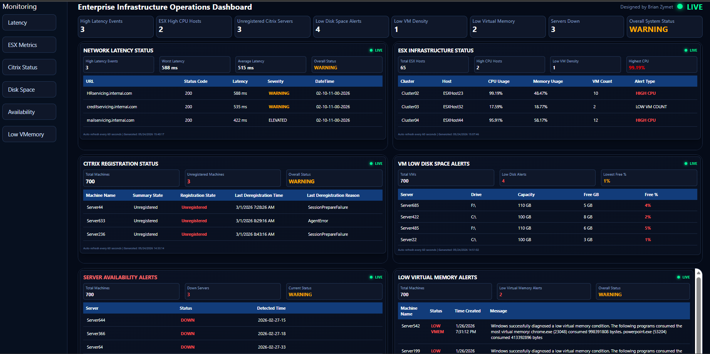
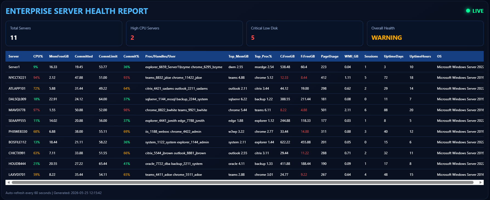
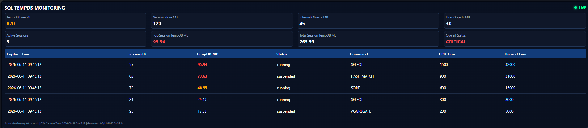
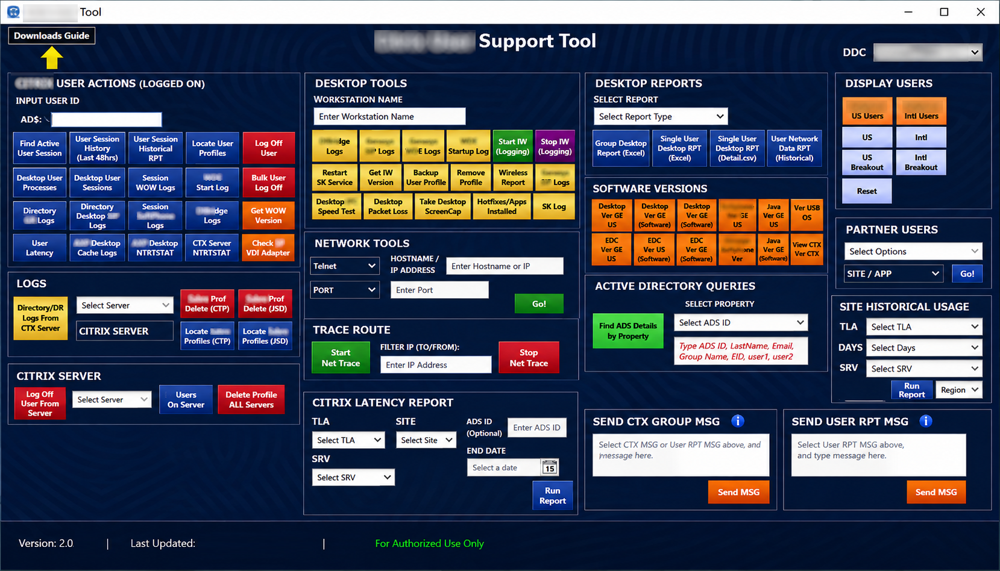
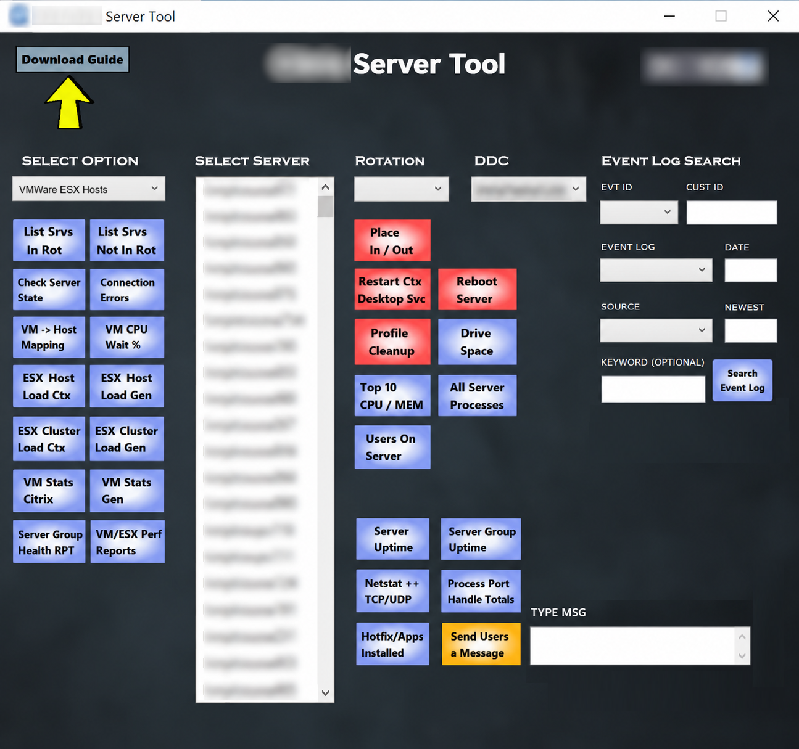
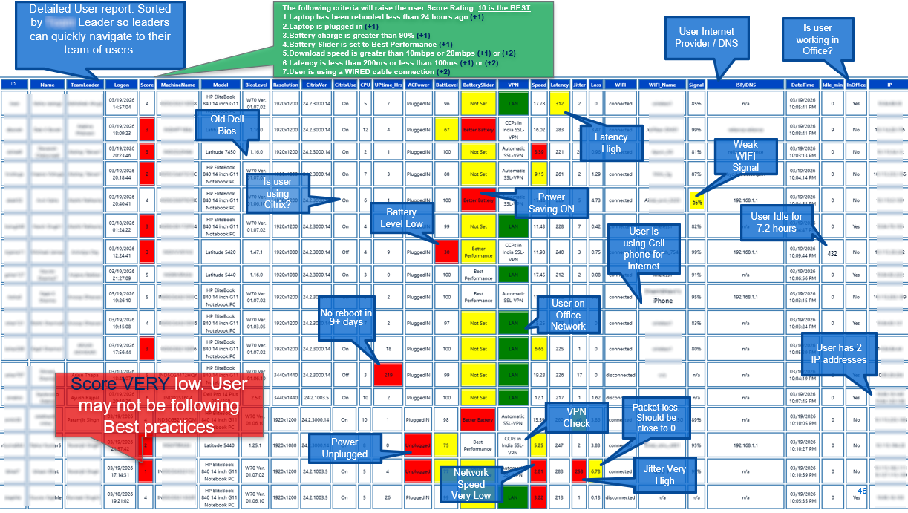
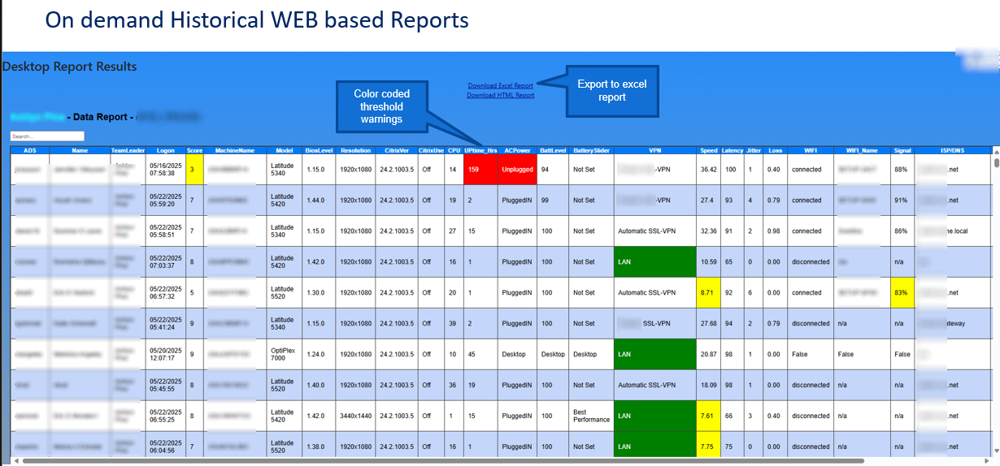
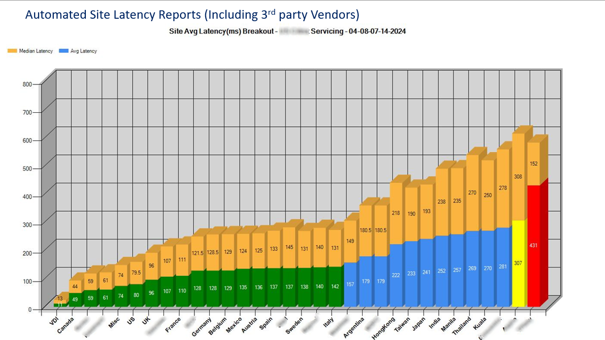
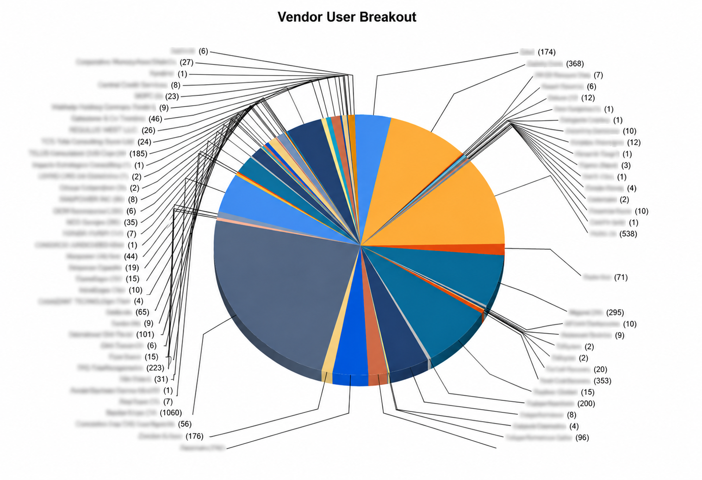

# Unified Infrastructure Monitoring Dashboard

Enterprise infrastructure monitoring platform integrating VMware ESX telemetry, Citrix monitoring, network latency analytics, server health reporting, and operational automation pipelines through centralized HTML dashboards and JSON aggregation.

The platforms below were designed not only to provide observability, but also to drive operational action. Telemetry events could trigger automated alerting, ServiceNow incident creation, workflow automation, remediation activities, and team-specific routing through REST API integrations, enabling a more proactive and scalable operational support model

---

## Technologies Used

- PowerShell Automation
- HTML
- CSS
- JavaScript
- JSON Telemetry Aggregation
- VMware ESX Monitoring
- Citrix Infrastructure Monitoring
- Operational Analytics
- Infrastructure Alerting

---

## Dashboard Preview

## Features
- Easily adaptable to add any monitoring metric needed (not just what is shown)
- Real-time dashboard updates
- Auto-refreshing operational telemetry
- Infrastructure alerting and health monitoring
- VMware ESX operational visibility
- Citrix registration monitoring
- Network latency analysis
- Server availability monitoring
- Low disk space alerting
- Low virtual memory monitoring
- JSON-based KPI aggregation
- Responsive dashboard UI
- Enterprise operational reporting visualizations

## Live Dashboard

https://bzymet.github.io/enterprise-monitoring-dashboard/

This repository contains sanitized demonstration data only and does not include production infrastructure information.

---

## Server HealthDashboard Preview

A lightweight enterprise infrastructure monitoring platform built with PowerShell, HTML and CSS that generates real-time operational dashboards for the enterprise server environment.

This project demonstrates automated infrastructure observability workflows including live telemetry collection, threshold-based alerting, KPI aggregation, and dynamic HTML dashboard generation without requiring external monitoring platforms or databases.

Features:

* Real-time server health dashboard
* CPU, memory, storage, and deep system/process level monitoring
* Auto-refreshing HTML reporting
* Threshold-based visual alerting
* Enterprise-style operational reporting
* Lightweight static web deployment
* GitHub Pages compatible
* Responsive dashboard interface

Technology Stack:

* PowerShell
* HTML5
* CSS3
* CSV data pipelines

This repository contains sanitized demonstration data only and does not include production infrastructure information.

---

## Enterprise SQL TempDB Monitoring & Operational Analytics

PowerShell-based monitoring and analytics solution designed to provide
real-time visibility into SQL Server TempDB utilization, session activity,
resource consumption, and operational health.

## Key Features

* TempDB free space monitoring
* Version store analytics
* User/Internal object tracking
* Active session visibility
* CPU and elapsed time monitoring
* KPI dashboard generation
* JSON telemetry aggregation
* HTML operational reporting
* Threshold-based alerting support

## Technical Highlights

* PowerShell Automation
* SQL Server Monitoring
* T-SQL Analytics
* Operational Telemetry
* Infrastructure Observability
* Performance Analytics
* Data Aggregation Pipelines
* HTML/CSS Dashboard Development
* JSON-Based KPI Reporting
* Operational Reporting & Visualization
* Threshold-Based Alerting
* SRE Monitoring Concepts

---

## Infrastructure Support Automation Toolkit

A custom-built enterprise support operations platform developed in C# with integrated PowerShell automation to streamline infrastructure support workflows, operational visibility, and administrative task automation across Windows environments.

# Enterprise Support Operations Tool

This tool was designed to centralize commonly used operational functions into a single interface for SRE teams, support engineers and administrators, reducing manual effort and accelerating troubleshooting across distributed enterprise systems.

## Key Features

* Real-time infrastructure support utilities
* Integrated PowerShell execution engine
* Automated operational workflows
* Multi-tool technician support interface
* Remote system management capabilities
* Server health and infrastructure visibility
* Session and process monitoring
* Log collection and diagnostic automation
* Operational reporting and telemetry integration
* Rapid remediation and support tooling

## Technical Highlights

* Built using C# and Windows Forms/WPF
* Backend automation powered by PowerShell
* Dynamic UI-driven operational workflows
* Integration with enterprise infrastructure tooling
* Modular utility framework for extensibility
* Automated data collection and execution pipelines
* Lightweight deployment architecture

## Purpose

The platform was created to improve operational efficiency, reduce repetitive manual tasks, and provide centralized access to critical support functions used during daily infrastructure operations and incident response activities.

## Technologies Used

* C#
* .NET
* PowerShell
* Windows Administration APIs
* HTML/CSS Reporting
* CSV Data Processing

## Notes

All screenshots and demonstration data included in this repository have been sanitized to remove any production-sensitive or identifiable enterprise information.

---

## Enterprise Infrastructure Operations & Telemetry Platform

A custom-built enterprise support operations platform developed in C# with integrated PowerShell automation to streamline infrastructure support workflows, operational visibility, and administrative task automation across Windows environments.

# Enterprise Infrastructure Operations & Telemetry Platform

This enterprise infrastructure operations platform was developed using C#, PowerShell, Citrix SDK integrations, Active Directory enrichment, and Windows infrastructure telemetry pipelines to centralize operational administration, event correlation, realtime infrastructure analytics, and remediation workflows across large-scale Citrix and Windows server environments.

The platform consolidates 50+ numerous infrastructure engineering and operational support functions into a unified interface designed to streamline incident response, operational diagnostics, telemetry analysis, server administration, and infrastructure observability initiatives. Integrated automation workflows allow infrastructure and SRE teams to rapidly execute operational tasks, place servers in/out of rotation, collect infrastructure telemetry, analyze server health metrics, search distributed Windows event logs across hundreds of systems in seconds, and perform centralized remediation activities from a single operational platform.

Core capabilities include real-time infrastructure telemetry analysis, distributed event log aggregation and search, server and Citrix administration, process and session analytics, infrastructure health reporting, operational remediation tooling, server performance diagnostics, and centralized operational workflow automation.

The platform was designed to improve operational efficiency, reduce incident response time, enhance centralized infrastructure visibility, and provide scalable operational tooling capable of supporting enterprise infrastructure engineering and observability initiatives.

---

## Endpoint Experience Analytics & Operational Telemetry

This enterprise endpoint analytics and user experience platform was developed using PowerShell, HTML, CSS, and .NET Core MVC to provide realtime operational visibility into endpoint health, Citrix performance, network quality, and end-user computing conditions across distributed enterprise environments. The solution combines automated telemetry collection, web-based reporting delivered through IIS-hosted MVC applications, and scheduled email reporting to provide support and SRE teams with actionable insight into 29+ key performance data points, and overall user experience conditions.

The platform was designed to proactively identify degraded user conditions before escalation by correlating infrastructure telemetry, endpoint metrics, and operational scoring into a centralized analytics interface. Dynamic visual indicators and health scoring models help operational teams rapidly identify devices with performance degradation, poor network conditions, outdated BIOS versions, extended uptime, weak wireless connectivity, VPN instability, or abnormal infrastructure behavior.

Reporting capabilities include automated HTML email delivery, centralized web dashboards, historical operational views, and realtime support visibility through IIS-hosted .NET Core MVC frontends integrated with backend PowerShell data collection and telemetry aggregation pipelines.

---
## WEB based Endpoint Experience Analytics & Operational Telemetry

Web-based operational analytics and endpoint telemetry platform developed using ASP.NET Core MVC, PowerShell automation, HTML/CSS, and IIS. Designed to provide historical infrastructure reporting, real-time operational visibility, threshold-based alerting, telemetry analytics, Excel export capabilities, and centralized reporting workflows for enterprise infrastructure and SRE operations teams.

The platform also includes searchable historical telemetry reporting capabilities, enabling infrastructure and operations teams to perform trend analysis, historical incident investigation, user session analytics, and operational baseline comparisons across enterprise endpoint environments. Historical reporting workflows allow engineers to rapidly identify recurring infrastructure issues, analyze long-term performance degradation, and correlate operational anomalies across large-scale distributed environments.

---

## Enterprise Latency Analytics Reporting

Automated infrastructure latency analytics reporting built using PowerShell-based telemetry aggregation and operational performance visualization techniques.

This enterprise Citrix latency analytics platform was developed using PowerShell, Citrix SDK integration, Active Directory lookups, HTML, and CSS to provide realtime visibility into user session latency across globally distributed enterprise and vendor partner environments. The reporting engine aggregates live Citrix session telemetry and enriches it with Active Directory metadata including user location, building assignment, organizational details, and partner affiliation to produce a consolidated operational view of user experience conditions across the environment.

The platform was designed to support SRE, infrastructure engineering, and operations teams by enabling rapid identification of degraded sites, high-latency user populations, and regional performance bottlenecks affecting enterprise productivity. Automated data collection pipelines retrieve session metrics directly from Citrix infrastructure components while correlating user identity and geographic information through Active Directory integration to provide enhanced operational context and site-level visibility.

The resulting analytics are rendered into automated HTML reports and fully sortable excel workbooks, and operational dashboards that visually rank latency conditions across all enterprise locations and vendor partner sites using threshold-based health categorization. By combining median and average latency comparisons with enriched user and site metadata, the platform helps operational teams quickly identify instability, network degradation, infrastructure saturation, and location-specific performance anomalies across large-scale distributed Citrix environments.

---

## Operational Telemetry & Vendor Utilization Reporting

This vendor footprint analysis provides a visual representation of global user distribution across enterprise locations, operational sites, and external vendor partner organizations within the environment. The report aggregates user counts by location and partner affiliation to deliver a high-level view of infrastructure utilization, workforce concentration, and third-party operational presence across the platform.

The visualization was designed to support operational planning, capacity management, vendor oversight, and infrastructure scaling by identifying where users are concentrated throughout the enterprise ecosystem. By consolidating global user footprint data into a single graphical view, support and leadership teams can quickly assess regional distribution trends, partner dependency, and overall environment composition.

This enterprise user footprint analytics platform was developed using PowerShell, Citrix SDK integrations, Active Directory enrichment, and automated reporting pipelines to provide centralized visibility into global enterprise and vendor-partner user distribution across large-scale Citrix/VDI environments.

The reporting engine aggregates live session telemetry and correlates user-specific Active Directory metadata including geographic location, site assignment, organizational hierarchy, and vendor affiliation to generate realtime operational analytics and infrastructure utilization reporting. Automated PowerShell data collection workflows dynamically classify and map thousands of enterprise and partner sessions into consolidated visual reporting models designed to support infrastructure engineering, SRE, operational capacity planning, and enterprise environment visibility initiatives.

The resulting analytics provide operations and engineering teams with a high-level visualization of global user footprint distribution across internal business units, regional office locations, and external vendor servicing environments.

---
